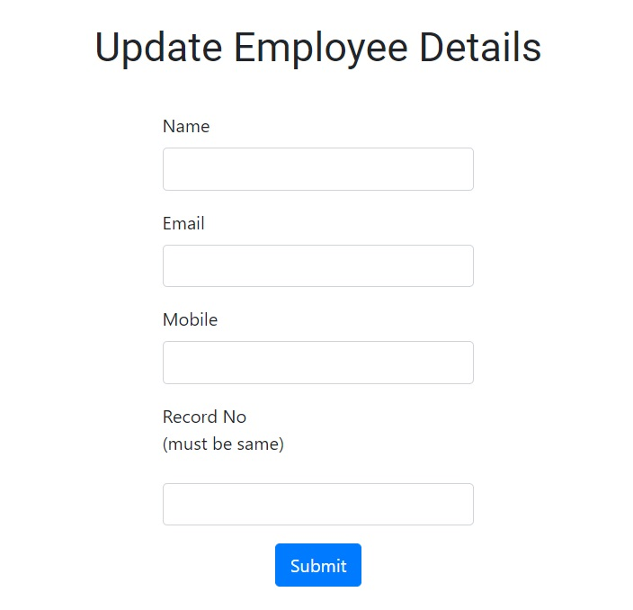
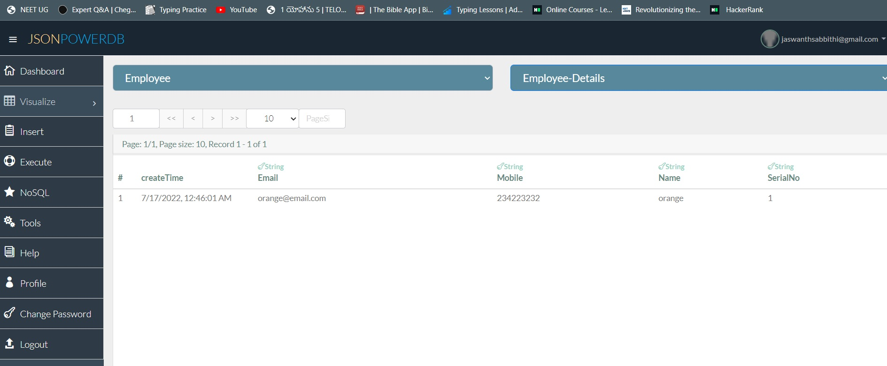

# JsonPowerDB 

[Documentation Link](http://login2explore.com/jpdb/docs.html)

## "This project is all about basics of JsonPowerDB (JPDB) and how to use JPDB for CRUD operations." 

### About JsonPowerDB:

- JsonPowerDB is a Real-time, High Performance, Lightweight and Simple to Use, Rest API based Multi-mode DBMS. JsonPowerDB has ready to use API for Json document DB, RDBMS, Key-value DB, GeoSpatial DB and Time Series DB functionality. JPDB supports and advocates for true serverless and pluggable API development.

### Benefits of using JsonPowerDB

- Simplest way to retrieve data in a JSON format.
- Schema-free, Simple to use, Nimble and In-Memory database.
- It is built on top of one of the fastest and real-time data indexing engine - PowerIndeX.
- It is low level (raw) form of data and is also human readable.
- It helps developers in faster coding, in-turn reduces development cost.

### Screenshots:

### Functionalities:
- Add the Employee details and save them in JSONDB
- delete the details and update the details using the record number 
- show the employee details by using name and render the results  below the form
